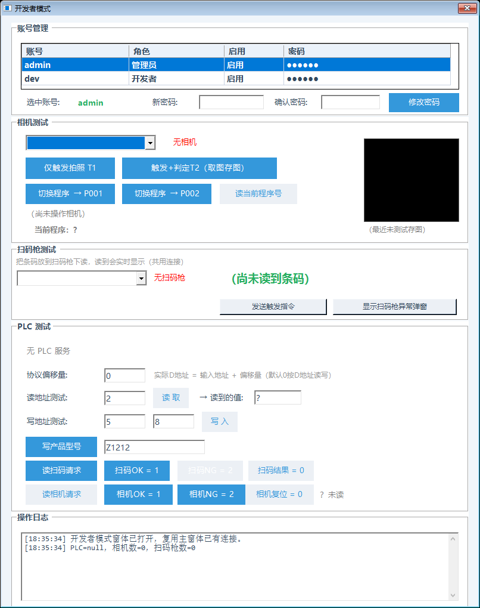
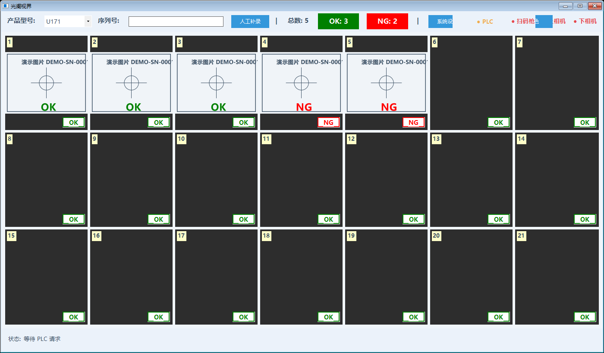

# 光阑视界内部手册

## 一、系统全景

WinForms + .NET Framework 4.7.2（C# 7.3），四层单向依赖：

| 层 | 文件归属 | 一句话 |
| --- | --- | --- |
| 界面 | Views/（9 窗）+ Controls/ | 只呈现 + 事件接线，禁网络 IO |
| 编排 | Services/ProductionCoordinator.cs | 三通道状态机（扫码 40001/上相机 40002/下相机 40003），业务唯一大脑 |
| 通讯 | Services/PlcService（从站 502）/KeyenceIV4Camera（T1/T2/RT/PW/OF）/ScannerTcp+Serial/ImageStore | 连接管理走上位机通讯封装范式（手动超时/锁串行化/后台心跳） |
| 存储 | Utils/ConfigStore + Models/AppConfig + Utils/SecurityUtil | 小驼峰 json，密码只存 SHA-256 |

第三方 dll 拷 `CommandCenter/libs/` 直接引用，离线可编译；发布走
`build-obfuscated.ps1`（混淆 + 打包 zip，Models 命名空间豁免）。

## 二、权限矩阵

| 账号 | 默认 | 进哪 | 能干什么 |
| --- | --- | --- | --- |
| admin（管理员） | admin/admin123 | 系统设置 | 全部业务配置，保存即热更 |
| dev（开发者） | dev/dev123 | 开发者模式 | 通讯验证 + 账号管理（重置**任意**账号密码），除账号管理外不产生配置改动 |

记住密码 DPAPI 存 `%LOCALAPPDATA%\CommandCenter\`（admin/dev 分文件互斥，
登一方清另一方，改密码也清）。现场交付必须改两个初始密码并记录在案。

## 三、主界面

`Views/MainForm.cs`：标题栏（型号下拉 SwitchModel 只重建协调器、设备不断连；
切型号即写 PLC 型号区）+ 窗口矩阵（`DisplayConfig.ResolveLayout` 唯一口径，
自适应列≤7）+ 状态栏。计数是**当前件**点数（扫码即清零，V2.14.28）。
窗口双击全屏（`_fullScreenForm`，ShowInTaskbar=false）。徽标只随开关显隐，
未判定默认绿 OK。图标走 `Utils/AppIcon` 取 exe 内嵌（V2.16.5）。

## 四、参数设置逐项

`SettingsForm`（构造传 clone，确定才写回，取消不落盘）：

- PLC：监听 IP/端口 + 通道地址全收 `PlcConfig`（配的是 DataStore 索引=
  协议号-40000，零换算）。`ModelIndexes` 弹窗维护（ModelIndexEditForm，
  新增型号自动回流 ProductModels 候选）。

- 相机：cameraId 真编号（=存图目录号，禁调行序冒充）；PLC 通道 0=不轮询；
  上→19.87.6.213→D:\IV存图\2，下→19.87.6.212→D:\IV存图\1（反配对是现场实测，
  谁"纠正"谁背锅）；OutputFormat 恰好 2 位；stationPrograms 默认表 +
  modelStationPrograms 按型号分表（运行时先查型号表、回退默认表）。
- 扫码枪：Mode 缺省 Tcp；Tcp 连上自动发 TriggerCommand（LON+\r\n）；
  IgnoreScanTexts 命中走 ScanFailed→协调器自动重发 LON（3 次/1.5s，
  耗尽才写 2，PLC 死等补录覆盖成 1）；MainForm 同事件弹 ScannerFailForm
  （30s 节流 + 今日不再提醒 + 读到真码自动关）。
- 显示/存图：见客户手册，另注意 SubDirs 禁止整条路径粘一层（脏配置三层防御自愈）。

## 五、开发者模式与账号管理

`DeveloperModeForm`：复用主窗体 `_plc/_cameras/_scanners` 实例（禁新建连接，
关闭不 Dispose；扫码枪只订阅收码）；T2 走 `btnTriggerRead`（触发+判定+取图闪图
存图，点位固定 1）；PLC 区读写寄存器（偏移 0~65535 越界拦截）；扫码枪区读码展示
+ `SendTrigger` 手动重发。账号管理区列全部账号（密码掩码），重置密码只落
SHA-256（≥6 位 + 两次一致）+ 清双角色记住记录。

## 六、账号开户续期全流程

1. 交付：改 admin + dev 初始密码（登录框改密 / 开发者模式重置），记录封存。
2. 记住密码：让现场明确"勾了=本机自动填"，离职交接先清记住记录
  （改一次密码自动清，最稳）。
3. 遗忘：dev 进开发者模式重置 admin；admin 丢了且 dev 也丢了 → 改配置
   `security` 段哈希（用工具算 SHA-256 小写 hex）后重启。
4. 禁止：配置文件里写明文密码、把记住文件拷到别的电脑（DPAPI 绑定用户，
   拷走无效，正好防扩散）。

## 七、工艺知识

1. 三拍握手：PLC 写请求≠0 → 上位机写结果≠0 → PLC 复位请求=0 → 上位机复位结果。
   请求寄存器 PLC 写 PLC 清，上位机只碰结果区。
2. 判定即写：T2 一判完立刻写 40005/40006，不等取图归档；通道释放等
   "PLC 复位 + 拍照 Task 结束"（防同相机并发取图删源混图）。
3. 结果尽早清零：PLC 复位一被观察到（边沿记忆）立即把结果清 0，
   残留窗口从 3~5s 缩到百 ms 级（防 PLC 快轮询提前消费下一拍）。
4. 2=死等补录：40004=2 时 PLC 不复位不判 NG，一直等上位机覆盖成 1；
   补录弹窗【稍后处理】不是放行，稍后必须补。
5. 脉冲请求是 PLC 的 bug：PLC 写 40002 后必须保持到读到结果≠0，
   写完立刻清零会导致上位机轮询抓不到（点位缺失）。
6. 相邻同程序跳 PW：`SwitchProgram` 缓存上次程序号，一致不重发；
   断线重连必须重置缓存（否则拿默认程序错拍）。
7. 应答必须验前缀：无协议帧无标识，发前排空残留、读到期望前缀（T2/RT、
   PW/PW…）才认，ER 视为本指令回执交上层判失败。
8. 取图事件路径优先：watcher 事件记实际路径，同主名配对 jpeg+iv4p；
   jpeg 先到先返回显示，iv4p 迟到只少复盘副本。

## 八、排障手册

| 现象 | 先查 | 升级开发条件 |
| --- | --- | --- |
| PLC 灯红 | 端口占用（netstat 502）、防火墙、监听 IP | 监听抛异常、重建后仍红 |
| PLC 黄但主站说连上了 | unitId 对不上、主站读写地址段 | 从站 Masters 为空但 TCP 通 |
| 点位缺失（日志无触发） | PLC 是否脉冲式写请求（保持了吗） | 保持了仍抓不到（轮询周期问题） |
| NG 收不到/OK 正常 | 结果残留窗口、PLC 轮询时机 | 点位推进推断与清 0 时序（V2.14.44 注释） |
| 双重触发（连拍两张） | 是否刚切型号/热更（磨合期）+ 回调重入互斥 | 磨合期外仍双发 |
| 取到别枪的图 | 事件路径 vs 扫目录回退、目录堆叠 | 同主名配对仍错乱 |
| 存图嵌套多层 | SubDirs 有没有整条路径粘一层 | Normalize 没自愈 |
| 登录记住错乱 | 双角色文件是否互斥清理 | DPAPI 换用户失效（预期内，删文件） |

通用三板斧：`Logs/运行日志_*.log` 当天文件 → 开发机 Debug 复现 →
还不行带日志 + Mapping.txt（混淆版）找开发。

## 九、交付维护清单

- 部署：`bin/Obfuscated/` 整个目录（或上传 zip 解压），含 exe + 2 dll + config。
- 快捷方式：跑 `tools/Create-DesktopShortcut.ps1` 建"光阑视界 IrisVision"。
- 首检：改双密码、切一遍型号、首件全窗出图、出一件 NG、查存图目录。
- 留档：appconfig.json 备份一份（不含密码明文，本来也没有）、型号程序表导出确认。
- 日常：存图保留天数≠0（除非客户要求不清）、Logs 定期看、混淆包 Mapping.txt
  自己留底不发客户。

## 十、技术实现篇

- 编排（ProductionCoordinator）：职责=三通道状态机唯一收口；关键机制=复位边沿记忆
  + `_taskDone` 闸门 + 动态磨合期 + 轮询重入互斥；红线=通道号≠下标（经 cameraId 反查）、
  失败路径收口写 NG（finally 补 2，禁入口抢写）、换代 Task 只拦不杀。
- 判定（KeyenceIV4Camera）：职责=触发 + 读判定 + 切程序；关键机制=应答验前缀 + 残留排空
  + 触发计数跳变 WARN；红线=详细格式任一 NG 即 NG、PW 同号跳过但重连清缓存。
- 通讯（PlcService/ImageStore/ScannerTcpService）：职责=从站监听/取图归档/收码；
  关键机制=热更释放 `_network`（只 Stop listener 会残留 master 会话）/事件+轮询双保险
  取图/连上自动 LON；红线=UI 线程禁 IO、ImageStore 归 MainForm（协调器禁 Dispose）。
- 账号（SecurityUtil/LoginForm）：职责=哈希 + DPAPI + 互斥；红线=不明文、不跨机。
- MES（MesService + `sn` 段）：改配置够的=换 URL/超时/切 Mes/Plc（`DeliverSerialNumber`
  唯一收口）；必须改代码的=报文加字段/鉴权/换方法（`BuildPayload`/`SendSerialAsync`，
  细则见 `docs/MES对接说明.md`，甩给客户的附件就是它）。
- 规则（DisplayConfig/ConfigStore）：职责=布局唯一口径 + 旧配置自愈；红线=各层禁各写一套
  （ResolveLayout/AutoFitCameraStarts/ResolveWindowPointMap 共用）、WindowEnabled 跟点位走、
  存图点位=StationNo（靠 {相机} 层隔离）。
- 存储（ImageStore + 清理定时器）：职责=监听归档删源 + 按天清理；红线=只动保存根过期目录、
  盘符根放弃、绝不动 FTP 目录。

## 十一、自查回炉

- 技术自查：说得出三拍时序、2 的含义、判定即写与释放闸门、残留清零窗口、
  脉冲请求是谁的 bug、PW 跳过与缓存重置条件。
- 回炉对应节：触发双发→§八第 5 行 + V2.14.36/40；丢 NG→V2.14.42；补录卡死→V2.14.33；
  换图标→V2.16.5（app.ico 单一来源 + AppIcon）。
- 文档自查：客户版无 dev/密码以外的敏感；截图与按钮名/数字一致；改了代码先过
  `run-all` 再动文档（产品代码零改动不跑回归，截图 harness 不算产品改动）。
