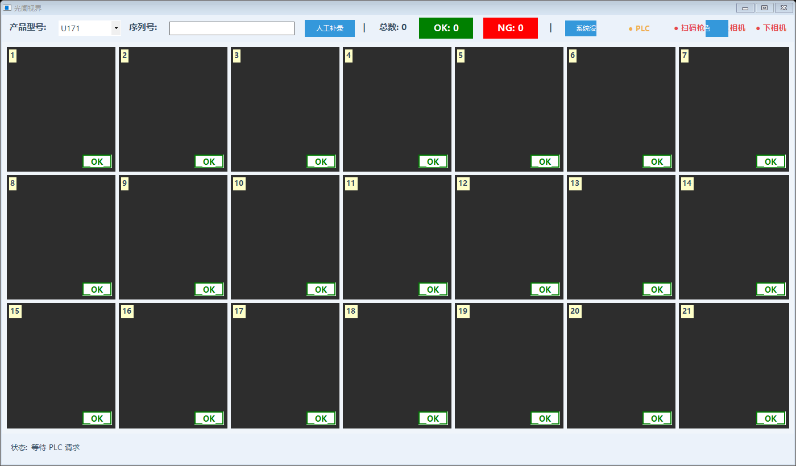
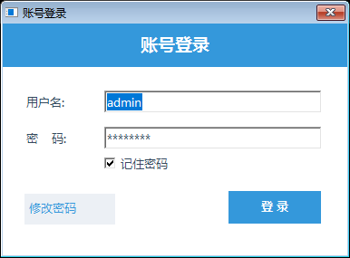
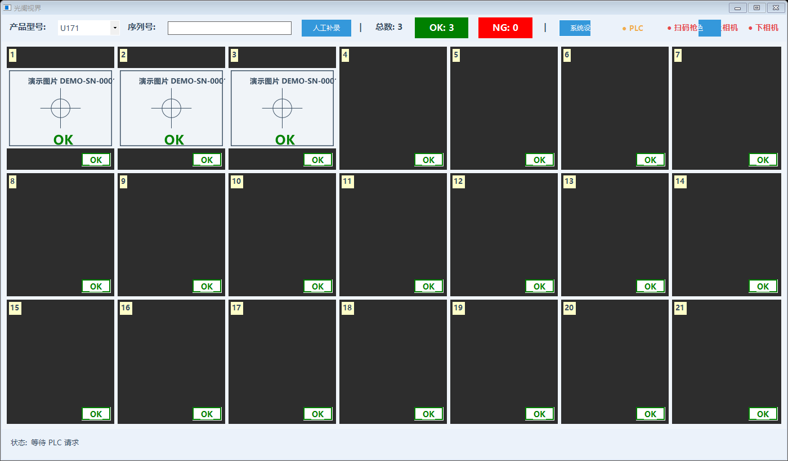
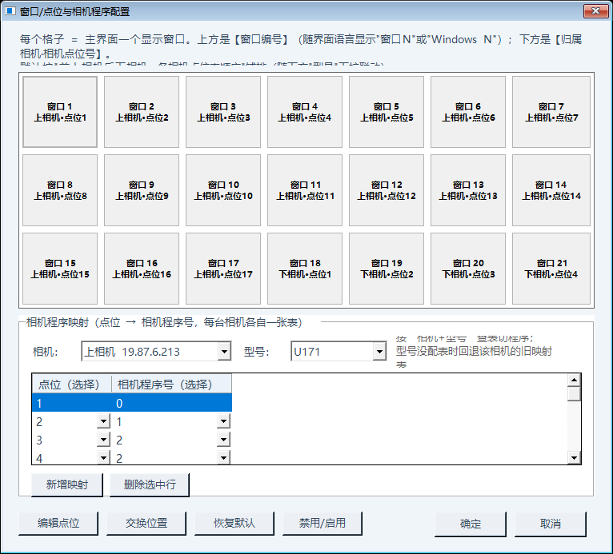
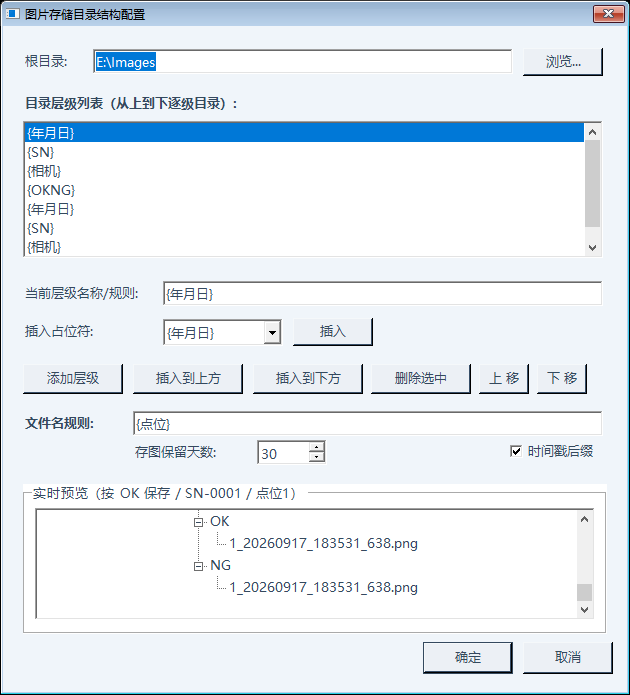
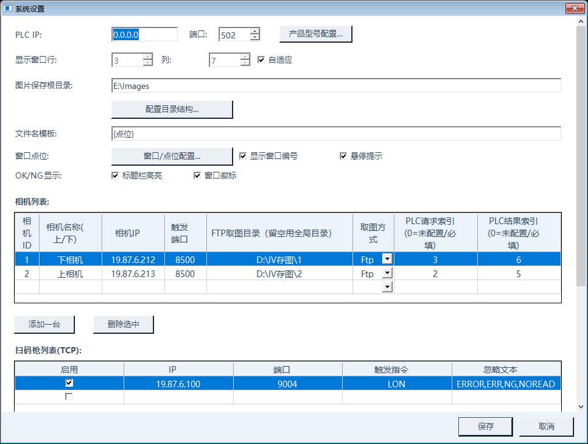
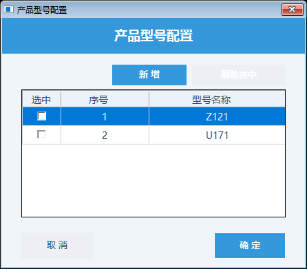

# 光阑视界客户技术手册

## 一、系统组成

光阑视界（IrisVision）是相机 + PLC 现场检测上位机：汇川 PLC 做主站指挥，
上位机做 Modbus TCP 从站监听本机 502；两台基恩士 IV4 相机（TCP 触发 +
FTP 推图）；基恩士 SR 扫码枪（TCP 无协议，默认 19.87.6.100:9004，
连上后发 LON 开始读码）。一轮生产：PLC 写扫码请求 → 上位机扫 SN →
PLC 写点位号 → 相机切程序拍照 → OK/NG 判定即写回 PLC → PLC 复位进下一拍。

## 二、账号权限

| 角色 | 怎么进 | 能干什么 |
| --- | --- | --- |
| 操作员 | 无需登录 | 看界面、切型号下拉、人工补录 |
| 管理员 | 点系统设置输管理员账号（出厂 admin/admin123，**首登请改密码**） | 系统设置全部配置，保存即热生效 |
| 开发者 | 找我方工程师要开发者账号 | 开发者模式：通讯验证 + 账号管理，不改业务配置 |

点系统设置每次都要登录，没有"记住登录状态"。记住密码只记住密码框、
存在本机加密文件里，换电脑不通用。管理员密码在登录框"修改密码"处改
（原密码 + 新密码两次一致、≥6 位）。

## 三、主界面

标题栏从左到右：产品型号下拉（切型号即生效）→ 序列号只读框 +【人工补录】→
总数/OK/NG（统计**当前这一件**的点数，新件开工自动清零）→ 系统设置/语言/主题 →
●PLC/●扫码枪/●相机灯。中间窗口矩阵一格=一个检测点（U171 共 21 格），
右下角徽标绿 OK/红 NG；底部状态栏看"等待 PLC 请求"即待机正常。
窗口双击放大、再双击或 Esc 还原。

## 四、换型清单

1. 标题栏型号下拉选新型号（候选 = 预置 U171/Z121 + 已配置型号），切换立即生效：
   写盘 + 按新型号查相机程序表 + 下发 PLC + 窗口重排，设备不断连。
2. 核对窗口总数：U171=21（上相机 17 + 下相机 4），Z121=29。
3. 首件试跑：每格出图、计数总数=点位数、PLC 侧 40007 序号与 40008~40012
   字符串读到新型号。
4. 注意：设置对话框里切型号**不实时影响主界面**，要点【保存】才统一刷新。

## 五、点位与程序配置方法

系统设置 →【窗口/点位配置】。上半格子矩阵：窗口↔相机点位，默认前上后下铺排；
选中两格【交换位置】（可跨相机）、【编辑点位】（选点位即与占用窗互换，保证唯一）、
【恢复默认】回出厂铺排。**右键点格子 = 禁用/启用该窗口**（被禁点位拍到会回 3 跳过，
PLC 侧按跳过处理）。下半表格：点位→相机程序号（每台相机独立一张、按型号分表），
点位不拍就删行，"不切换"=保持相机当前程序。

## 六、存图与记录

系统设置 →【配置目录结构】：根目录 + 逐级目录（每级一层名，可用
{年月日}/{SN}/{相机}/{OKNG} 占位）+ 文件名规则 + 存图保留天数
（默认 30 天自动清，0=不清）。相机每次拍照生成 jpeg（看图用）+ iv4p
（基恩士复盘用）一对，归档后删 FTP 源。历史查询直接到硬盘目录按
日期/SN/相机/OKNG 翻。

## 七、MES 联调自助闭环

扫码 SN 去向由配置文件 `sn.target` 二选一（默认 Mes：SN 不写 PLC、
后台 HTTP POST 给 MES；Plc：写 40013 起寄存器、不传 MES；无界面入口，
手改配置重启生效）。客户 MES 对接按"Mock 先行"两步走：

1. 要厂方拿 5 样：接收 URL、字段名清单、触发时机（扫到码就发还是 OK 才发）、
   字符集/时间格式、超时与重试要求。
2. 先对格式：把 `sn.target=Mes`、`mesUrl` 指向厂方测试地址试跑，
   看厂方收到 `{"sn","model","time"}` 是否正确；格式定稿后再切生产地址。
3. 配置字典：`mesUrl`（完整 http/https）、`mesTimeoutMs`（默认 3000，
   只决定单次成败、不卡 PLC 节拍）。
4. 排障三步：① URL 留空只记日志不报错（先填上）；② 厂方收不到先查
   上位机日志有无 POST 记录；③ 超时只记失败不重试（MES 是对账数据，
   PLC 流程不依赖它）。
5. 何时找我方：厂方协议定稿后报文要加字段/改方式（鉴权头、PUT、XML 等），
   把接口文档发我方，由我方改发送代码——配置解决不了的才到这一步。

扫码结果握手不受去向影响：40004 的 1/2 与人工补录覆盖流程永远不变；
Mes 模式下 40013 起 SN 区保持全 0，PLC 侧不用再读。

## 八、测试窗口

开发者模式是工程师验证通讯的窗口：相机 T1/T2 手动触发、PLC 寄存器读写、
扫码枪读码与发触发指令、账号管理。**只看不动手**：里面的按钮一点就真发指令，
生产中误点会干扰流程；需要验证时找我方工程师操作。

## 九、系统设置管理员实操

- PLC 区：监听 IP（0.0.0.0=所有网卡）/端口 502；【产品型号配置】维护
  型号↔40007 序号映射（新增型号自动进标题栏候选）。

- 显示区：行/列（勾自适应则自动铺排，列最多 7；行多出滚动条）、OK/NG 颜色
  （现场习惯绿/红）、徽标/编号/悬停显隐、标题栏各项显隐。
- 相机表：每台 IP/端口/真编号 cameraId（=存图目录号，**禁靠调行序改编号**）/
  FTP 取图目录（上相机→\2、下相机→\1，与安装位置反配对是现场实测决定的，
  不要"纠正"）/PLC 请求与结果通道（0=不参与轮询）。新增行保存前 Tags 保留映射，
  配好程序表再保存不丢。
- 扫码枪表：TCP（默认，连上自动发 LON）/串口两张表；"忽略文本"名单过滤
  读码失败的 ERROR 类推送（命中自动重发 LON 最多 3 次，耗尽才判 NG）。
- 点【保存】即热生效（设备不断连），【取消】不落盘。

## 十、排障

| 现象 | 先查 | 何时叫售后 |
| --- | --- | --- |
| ●PLC 常黄 | PLC 主站程序是否指向本机 502、网线、防火墙 | 主站配置确认无误仍黄 |
| 相机灯红 | 相机供电、网线、IP 改没改（设置页对照） | 灯绿但无图/判定全 NG |
| 窗口缺图但判定正常 | FTP 取图目录（相机侧推图配置）、磁盘满没满 | 缺图 + 日志报取图超时 |
| 扫码 ERROR 弹窗 | 条码脏/歪/激光口（先擦再看，瞬时失败会自愈） | 一直 ERROR、重发 3 次全灭 |
| 40004=2 卡住不动 | 等人工补录（PLC 死等 2 是协议定的，不是卡死） | 补录覆盖成 1 后仍不动 |
| 切型号窗口数不对 | 该型号点位表行数、映射长度 | 映射重置后仍错乱 |

## 十一、自查

- 当前型号、窗口数、40007 序号三处一致（标题栏 / 窗口矩阵 / PLC 读数）。
- 存图目录当天有新图，保留天数不是 0（除非明确要求不清）。
- 管理员密码已改非初始值；操作员知道人工补录入口。
- MES 模式确认：Mes 还是 Plc，双方按同一口径读写 SN。
