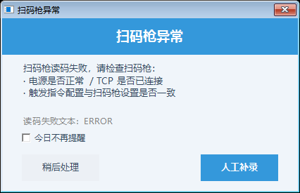
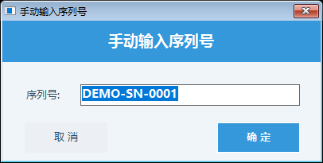

# 光阑视界操作员手册

## 一、软件一句话与硬件对照

光阑视界是产线检测用的看图软件：扫码枪扫出产品条码，两台相机轮流拍照，
每个检测点一张图、一个 OK/NG，全部显示在大屏窗口矩阵里。

它自己不指挥产线，听 PLC 的：PLC 说"扫码"，它就扫；PLC 说"几号点位拍照"，
它就拍；判完把 OK/NG 写回去，PLC 才放行到下一拍。

| 硬件 | 在软件里的名字 | 正常长什么样 |
| --- | --- | --- |
| 汇川 PLC | 标题栏 ●PLC 灯 | 绿=连上了；黄=软件等着、PLC 还没连进来 |
| 扫码枪 | 标题栏 ●扫码枪灯 + 序列号框 | 绿=连上了；扫到码序列号框自动出条码 |
| 上相机/下相机 | 标题栏相机灯 + 窗口矩阵出图 | 绿=连上了；拍照后对应窗口出图 |

## 二、开机与登录

1. 双击桌面"光阑视界 IrisVision"图标，等 2~3 秒，主界面铺满屏幕、
   出现一排排深灰色窗口就是启动成功。
2. 正常生产**不需要登录**，开机就能看。
3. 只有点"系统设置"才要找管理员输账号——那是改参数的地方，操作员不要点。

## 三、主界面四区

标题栏（最上面一行）：产品型号下拉、序列号框、【人工补录】、总数/OK/NG、
【系统设置】、几个状态灯。窗口矩阵（中间大片格子）：一格=一个检测点。
状态栏（最下面）：显示"等待 PLC 请求"就是正常待机。

## 四、标准生产流程

新产品一到，PLC 会先让软件扫码，序列号框里跳出条码就是扫到了。
接着相机逐个点位拍照，窗口里逐格出图、右下角徽标变 OK（绿）或 NG（红），
标题栏总数/OK/NG 跟着涨。一件做完、下一件到时，图片和计数自动清零重来。

上图是演示数据：3 个点全 OK，总数 3、OK 3。窗口里的"演示图片"字样说明
这张图是培训演示摆拍，现场看到的是真实零件图。

上图总数 5、OK 3、NG 2：第 4、5 格红徽标 NG。哪个格子红，就去看那格的图、
找对应的检测点位。

## 五、状态文字对照表

| 看到什么 | 意思 | 要不要动 |
| --- | --- | --- |
| 状态：等待 PLC 请求 | 待机，正常 | 不动，等上料 |
| ●PLC 黄灯 | 软件就绪、PLC 还没连进来 | 开机头一次正常；生产中变黄叫技术员 |
| ●PLC 绿灯 | 主站连上了 | 不动 |
| 绿灯变红灯（任一） | 那台设备断了 | 先看网线/电源（见第七节），不行叫技术员 |
| 窗口深灰 + 绿 OK 徽标 | 还没轮到这个点 | 不动 |
| 序列号框空着、流程不动 | 没扫到码 | 先看条码正不正（见第七节） |

## 六、报警处置：扫码枪异常弹窗

扫码枪连续几次读不到码，会弹出这个框：

- 【人工补录】：你拿着条码去框里手输（见下），本件继续走，不停线。
- 【稍后处理】：先不输，框自己关掉。**注意：这件产品 PLC 会一直等着，
  稍后必须点标题栏【人工补录】把码补上，流程才继续**——"稍后"不是"放过"。
- 勾上"今日不再提醒"，当天不再弹（判定和记录照常，只是少打扰）；
  第二天自动恢复。如果扫码枪修好了、扫到了真码，这个框自己会消失。

人工补录框长这样，把码输进去点确定（空着点确定没用，会被拦下来）：

## 七、易混按钮

- 人工补录 vs 扫码：扫码是自动的（有码自己进框）；人工补录是扫码失败时的
  手动顶班。框是只读的，手不能直接在框里改，只能点按钮弹窗输。
- 稍后处理 vs 放过本件：稍后处理只是把弹窗关掉，本件还在等码，
  必须稍后补录覆盖，PLC 才放行。
- 型号下拉 vs 系统设置：换产品型号点标题栏下拉就行（见第八节），
  不用进系统设置；系统设置是管理员改参数的，操作员别进。

## 八、型号与换型

标题栏"产品型号"下拉（U171/Z121）就是当前在做的产品。换产品时：
1. 点下拉选新型号，窗口数量会自动变（U171 是 21 个窗口）。
2. 看一眼窗口数对不对、状态灯全不全绿，再放第一件试跑。
3. 首件每个窗口都出图、计数正常，才算换好。

## 九、历史查询

检测过的图存在电脑硬盘里，按"日期 → 条码 → 相机 → OK/NG"分文件夹放着。
要找某件的图：打开存图根目录，按日期进、按条码找，再看 OK 还是 NG 文件夹。
目录位置问技术员要（每台电脑配的不一样），不要自己挪文件夹。

## 十、测试窗认得别乱点

点系统设置输错账号、或者看到"开发者模式"窗口（黑底测试按钮一堆那个），
直接关掉。那是工程师验证通讯用的，里面的按钮一点就真发指令，
会干扰正常生产。

管理员登录长这样，输账号密码的框只该管理员碰：

## 十一、每班点检

1. 开机进主界面，21 个窗口全在（U171），没有少格、没有弹窗报错。
2. ●PLC 绿灯（或生产前是黄、连上变绿），扫码枪灯绿。
3. 拿一件试跑：序列号框出码、窗口逐格出图、计数总数对得上点位数。
4. 出一件 NG 试试（拿不良品或挡一下相机）：红徽标亮、NG 计数涨。
5. 下班看一眼状态栏没有红色报错，正常关机（直接点右上角×）。

## 十二、禁忌清单

1. 不进系统设置（找管理员）。
2. 不拔相机/扫码枪网线，不关 PLC 电。
3. 不删存图目录里的任何文件夹（那是检测记录）。
4. 不在序列号框上双击（没用），补录只点【人工补录】按钮。
5. 扫码枪读不出先看条码脏不脏、歪不歪，别先重启软件。
6. 电脑弹 Windows 更新/杀毒提示别点，叫技术员。
